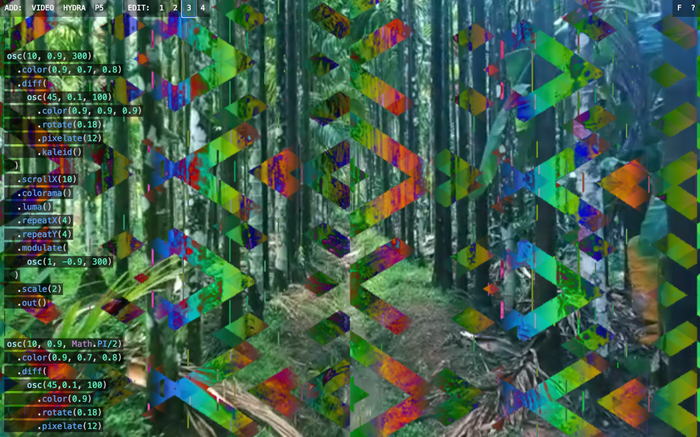
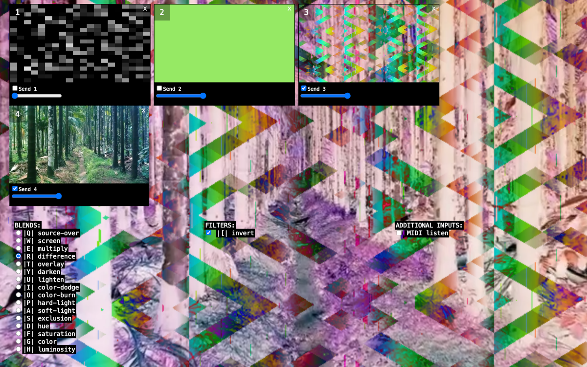

# flommo



A browser-based mixed media flow machine ~ in the space between VJ and livecode interface.

Live version is at https://flommo.dansakamoto.com/

Flommo allows you to add and blend instances of [hydra](https://hydra.ojack.xyz), [p5.js](https://p5js.org), and video. Hydra and P5 instances can be live coded (edited on the fly), and the different visual inputs can be mixed via keyboard shortcuts, midi inputs, or the GUI.

## Background

Flommo is designed to allow a performer to create live visuals while switching between a live code mindset and a VJ mindset. Created to be as DIY as possible, Flommo runs in the browser and attempts to provide enough controllability to plug in a projector and perform without needing expensive VJ software or a complicated equipment configuration.

It's worth noting that Flommo doesn't necessarily do anything that can't be done via one of the included libraries. For instance, Hydra provides a way to instantiate P5 inside of it, and both Hydra and P5 have ways of loading and playing video. Instead, Flommo aims to provide a different approach to structuring ideas, a performance, or a play sesh which may be useful for some - particularly anyone coming from a VJ background, or who otherwise likes having a visual mixer.



## Requirements

- Node.js
- A running postgres database

## Quickstart

- Rename .env.example to .env and add the credentials for your database
- Run:

```
npm i
npm start
```

- load localhost:3000 in your web browser
